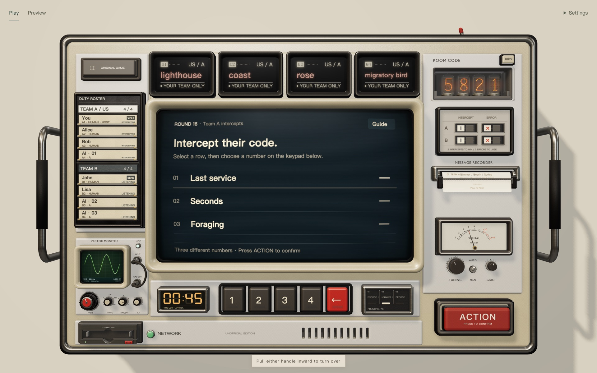
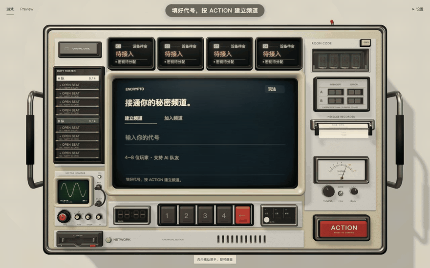
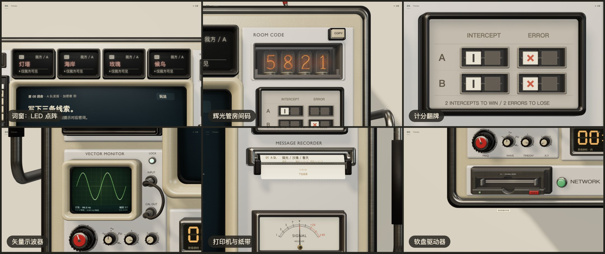

# Encrypto

[中文](README.md)

A cipher terminal that runs in your browser. Two teams pass coded clues across it: clear enough for teammates, opaque to the other side.



## What it is

Encrypto is an online multiplayer word game inspired by the board game *Decrypto*.

Each team has four keywords that only its own members can see. Every round, one player receives a three-digit code and writes one clue for each keyword the code points to. Teammates try to recover the code from the clues, while the opponents compare them with earlier clues and try to intercept it. Intercept the other team twice and you win; misread your own team twice and you lose.

The whole interface is one modeled machine. Its screen, keyword windows, name cards, score flags, paper tape and floppy disk each do one job. Keys press, knobs turn, and the machine can be turned over to pull its cables.



<sub>The recording uses the Chinese interface. [Sharper video (52 s)](docs/media/gameplay.mp4)</sub>

## What you get

- **Play with friends.** Open a room, share its four-digit code, and split 4 to 8 players into two teams.
- **AI teammates.** Any seat can be given to an AI player that writes clues and guesses codes.
- **Games survive.** After a page reload, a lost connection or a server restart you return to your seat and your round.
- **Talk while you play.** When the server offers voice, the whole table hears you, or only your team when you whisper; while the code is being guessed, each team talks apart.
- **Chinese and English**, four colour themes, a compact layout for phones, and full keyboard and screen-reader access.

| | | |
| --- | --- | --- |
|  |  |  |
| Pull the paper tape to read every public clue | The rear: power, cables and sound | Keyword windows, Nixie tubes, score flags, vector monitor |

## Run it on your own computer

You need Go, Node.js, pnpm and make.

```bash
git clone https://github.com/ZinkLu/decrypto-the-game.git
cd decrypto-the-game

make run
```

Open <http://localhost:8080>.

## Documentation

The documentation is written in Chinese.

| | |
| --- | --- |
| [How to play](docs/gameplay.md) | Rules, how a round runs, what each part of the machine does |
| [Build and run](docs/getting-started.md) | Building, configuration, AI players, development and tests |
| [Deployment](docs/deployment.md) | Deploying with Docker, how rooms are kept |
| [Console design](docs/console/README.md) | Why it is a machine, design principles, the parts |
| [Console code](docs/console/code.md) | How the frontend is organised and how to extend it |
| [Backend architecture](docs/architecture.md) | Layers of the server, the round state machine, persistence |
| [WebSocket protocol](docs/protocol.md) | Every message between the page and the server |

The full index is in [docs/](docs/README.md).

## About the original

This is an unofficial, non-commercial fan project. Its gameplay is inspired by the board game *Decrypto*, designed by Thomas Dagenais-Lespérance and published by Le Scorpion Masqué. The web code and the main visual and interaction design were made for this project, and the word list in `server/internal/core/word_providers/words.txt` was compiled by its author. The project is not affiliated with, endorsed or sponsored by the original designer or publisher, and is not an official online edition.

To learn about or support the original, visit the [official website](https://www.scorpionmasque.com/en/decrypto) or the [official shop](https://shop.scorpionmasque.com/products/decrypto). This project is free and has no commercial plans.

The repository keeps its historical name, `decrypto-the-game`.

## License

Code and content that the author has the right to license are under the [MIT License](LICENSE). "Non-commercial" describes how the project is shared today and does not change what MIT grants for that content. MIT grants no rights to the *Decrypto* name, the original trademarks, artwork or other third-party content. Third-party [sounds and music](web/public/audio/CREDITS.md) and [fonts](web/public/fonts/README.md) are used under the licences of their sources.
