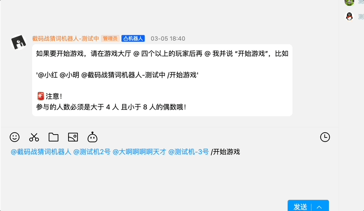

# Decrypto The Game

## 这是什么？

这是一个可以借助机器人玩 [谍报风云](https://boardgamegeek.com/boardgame/225694/decrypto) 游戏的软件。

> 目前只支持 QQ 频道机器人。

**QQ 机器人最近进行了更新，目前机器人已经无法使用，等待使用其他 QQ 机器人的 API 或者替换成其他的机器人平台**



游戏规则与流程可以查看[B站桌游怪讲解视频](https://www.bilibili.com/video/BV1Pt411K7ro/)。

## 如何使用

### 加入我的频道

你可以通过加入我的频道进行游戏，[频道链接](https://pd.qq.com/s/2f5oay2ts)。

你只需要在聊天室中 `@截码战猜词机器人` 然后再 @ 出和你一起玩的用户，机器人会为你们创建房间并主持游戏。

在游戏的过程中，你可以通过**命令**来让机器人告诉你当前的游戏状态，目前机器人支持的命令如下

1. `/开始游戏`
    
    触发方式: 大厅@机器人

    作用: 在大厅内艾特 3 人以上的偶数玩家，就可以开始游戏，同一个玩家无法身处两场不同的游戏。

2. `/结束游戏`

    触发方式: 游戏房间@机器人

    作用: 结束当前房间的游戏进程，注意，为了让玩家更好的复盘，机器人不会关闭房间。

1. `/关闭房间`

    触发方式: 游戏房间@机器人

    作用: 关闭该游戏房间，如果该房间中的游戏没有结束，则不允许关闭，特别的，在游戏结束后的一段时间内，机器人会主动关闭房间（暂时没有实现）。

1. `/词组`

    触发方式: 游戏中玩家私信机器人

    作用: 机器人会返回我方的 4 组单词

2. `/进度`

    触发方式: 游戏中玩家私信机器人

    作用: 机器人会返回当前的轮次信息，以及每个轮次


1. `/密码`

    触发方式: 当前轮次中加密的玩家私信机器人

    作用: 机器人会返回当前的加密玩家需要加密的密码与词组

1. `/我方`

    触发方式: 游戏中玩家私信机器人

    作用: 获取我方已使用的所有描述词

1. `/对方`

    触发方式: 游戏中

    作用: 获取对方已使用的所有描述词

### 自己部署机器人

1. 编译

    你也可以自己编译并运行自己的机器人。

    这需要你安装 go > 1.20，然后可以自行编译

    ```bash
    git clone https://github.com/ZinkLu/decrypto-the-game.git && cd decrypto-the-game && go build
    ```

    上面的命令应该会编译出名为 `decrypto-the-game` 的二进制文件。

2. 申请自己的机器人
    
    为了运行你自己的机器人，还需要在 [qq 开放平台](https://q.qq.com/#/app/bot) 申请自己的机器人。

    你也可以为机器人先添加相关的功能，目前机器人支持以下功能:

    ```text
    /开始游戏
    /结束游戏
    /关闭房间
    /词组
    /进度
    /密码
    /我方
    /对方
    ```

3. 运行

    申请机器人过后，应该有了机器人的 id 和 secret 信息，此时需要先设置对应的环境变量

    ```bash
    export BOT_ID=xxxx,
    export BOT_SECRET=xxx
    ```

    随后就可以运行机器人啦~

    ```bash
    ./decrypto-the-game
    ```

## 代码结构

### api

### fronts

### word_providers

## TODO & PR

紧急: 添加其他平台 bot，现在 QQ 频道进行了更新，不分功能已经不可用，准备迁移至 dodo, kook 或者 discord

1. 去除将 messages 包中所有的常量，使用 Function Call 作为获取信息的手段；
2. 优化 message 的输出，如果能申请到 Markdown Template 是最好的（如果不是 QQ 平台的话就）；
3. 添加基于 LLM 的 word provider；
4. 添加基于 LLM 的陪玩机器人（需要额外开辟一个仓库）；
5. 添加基于 LLM 的更加人性化的游戏流程回复？
