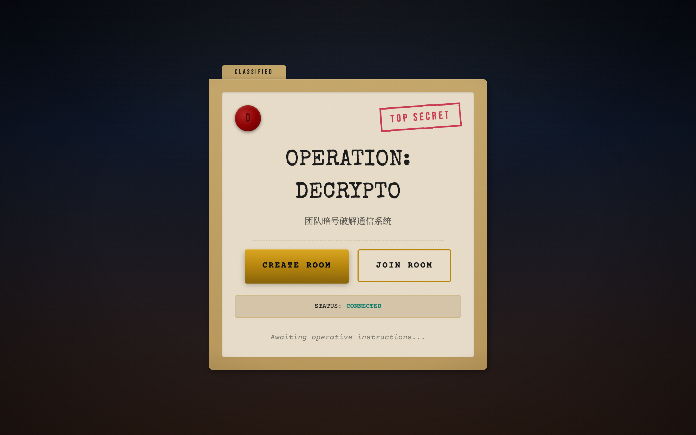
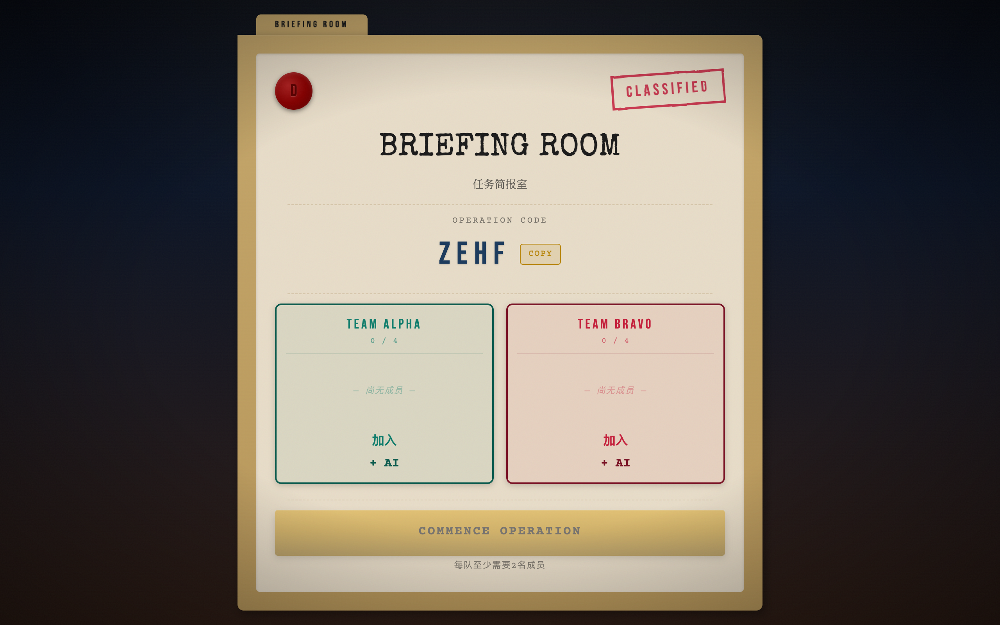

# Decrypto - 谍报风云

一个基于 Web 的 [Decrypto（谍报风云）](https://boardgamegeek.com/boardgame/225694/decrypto) 桌游实现，支持实时多人对战和 AI 玩家。

游戏规则可参考 [B站桌游怪讲解视频](https://www.bilibili.com/video/BV1Pt411K7ro/)。



## 功能特性

- **实时多人对战** — 基于 WebSocket，创建房间后分享房间码即可开始
- **AI 玩家** — 支持 Claude、OpenAI 及兼容接口（DeepSeek、Ollama 等）作为 AI 队友/对手
- **冷战情报风格 UI** — 打字机文字、蜡封、橡皮图章、机密文件夹等主题化组件
- **角色视角分离** — 加密者、队友、对手各自看到不同的界面和信息
- **断线重连** — WebSocket 自动重连并恢复游戏状态

## 快速开始

### 环境要求

- Go 1.20+
- Node.js 18+（pnpm）

### 构建与运行

```bash
# 克隆仓库
git clone https://github.com/ZinkLu/decrypto-the-game.git
cd decrypto-the-game

# 构建前端
cd web && pnpm install && pnpm build && cd ..

# 构建后端
go build -o server ./cmd/server

# 运行（words.txt 必须在工作目录下）
./server
```

服务启动后访问 http://localhost:8080 即可开始游戏。

### AI 玩家配置

AI 玩家功能需要设置 LLM API Key，支持以下两种方式（二选一）：

```bash
# 方式一：使用 Claude
export ANTHROPIC_API_KEY=sk-ant-...
./server

# 方式二：使用 OpenAI 兼容接口（OpenAI / DeepSeek / Ollama 等）
export OPENAI_API_KEY=sk-...
export OPENAI_BASE_URL=https://api.openai.com/v1  # 可选，默认 OpenAI
export OPENAI_MODEL=gpt-4o                         # 可选，默认 gpt-4o
./server
```

未设置 API Key 时，AI 玩家会使用固定的占位回复。

## 游戏流程

### 1. 创建/加入房间



创建房间后获得 4 位房间码，分享给其他玩家加入。房主可以为任意队伍添加 AI 玩家。每队至少 2 人才能开始游戏。

### 2. 游戏进行

每局游戏最多 16 轮（每队各 8 轮作为加密方），每轮流程：

1. **加密阶段** — 加密者收到 3 个密码序号（对应本队 4 个词中的 3 个），需要给出 3 条线索
2. **拦截阶段**（第 3 轮起）— 对方队伍根据线索猜测密码序列
3. **解密阶段** — 本队队友根据线索猜测密码序列

### 3. 胜负条件

- 成功拦截对方 **2 次** 即获胜
- 对方解密失败 **2 次** 也算己方获胜

## 技术架构

```
cmd/server/          # 入口
internal/
  core/              # 核心游戏逻辑（状态机、回合管理）
    word_providers/  # 词库抽象（基于 words.txt）
  ws/                # WebSocket 基础设施（Hub、Client、消息类型）
  room/              # 房间管理（创建、加入、队伍、AI 槽位）
  game/              # 桥接层（WebSocket <-> 游戏状态机）
  server/            # 消息分发（路由 WebSocket 消息到房间/游戏处理器）
  ai/                # AI 玩家（LLM Provider 抽象 + Claude/OpenAI 实现）
web/                 # React 前端
  src/
    pages/           # 11 个游戏阶段页面（角色视角分离）
    components/      # 主题化 UI 组件库（dossier 风格）
    store/           # Zustand 状态管理
    services/        # WebSocket 客户端
```

### 状态机

游戏回合按以下状态推进：

```
NEW → INIT → ENCRYPTING → INTERCEPT → DECRYPT → DONE
```

通过 Handler 注册模式（Observer Pattern）驱动，`AutoForward()` 自动推进状态并在每个阶段调用注册的回调。

### 前端技术栈

React 19 + TypeScript + Tailwind CSS 4 + Framer Motion + Zustand

## 测试

```bash
# Go 测试（room + ws 消息格式）
go test ./internal/room/ ./internal/ws/

# 核心游戏逻辑测试（需要在项目根目录运行，依赖 words.txt）
go test ./internal/core/
```

## License

MIT
