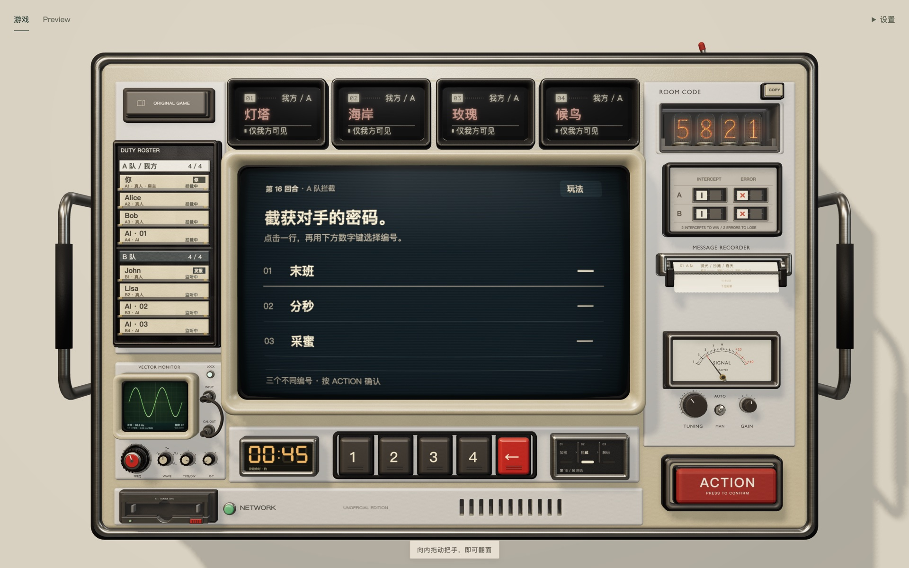

# Encrypto

[English](README.en.md)

一台开在浏览器里的密码通信机。两支队伍隔着它传暗号：让队友听懂，让对手听不懂。



## 这是什么

Encrypto 是一个多人在线的猜词游戏，玩法取材于桌游《Decrypto（谍报风云）》。

每队有四个只有自己看得见的密词。每个回合，一位队员拿到一组三位密码，为密码指向的三个词各写一条线索；队友要从线索里猜出密码，对手则对照历次线索，试着把它截下来。截获对手两次获胜，译错自己人两次落败。

整个界面是一台建模出来的机器。屏幕、词窗、名牌、计分翻牌、打印纸带和软盘各管一件事，按键可以按，旋钮可以拧，机器还能翻到背面去拔线。


<sub>[更清晰的视频（52 秒）](docs/media/gameplay.mp4)</sub>

## 有什么

- **和朋友联机。** 建一个房间，把四位房间码发出去，4 到 8 人分成两队。
- **人不够，AI 来凑。** 任何座位都可以交给 AI 队员，它会写线索，也会猜密码。
- **掉线不丢局。** 刷新页面、断网、服务器重启之后，你会回到原来的座位和原来的回合。
- **中文和英文**，四套配色，手机上有紧凑的界面，键盘和读屏软件都能操作。

| | | |
| --- | --- | --- |
|  |  |  |
| 拉出纸带，查看已公开的线索 | 背面：供电、接线和声音 | 词窗、辉光管、翻牌、示波器 |

想知道具体怎么玩，见[玩法](docs/gameplay.md)。

## 在自己的电脑上运行

需要 Go、Node.js、pnpm 和 make。

```bash
git clone https://github.com/ZinkLu/decrypto-the-game.git
cd decrypto-the-game

make run
```

打开 <http://localhost:8080>。版本要求、AI 队员的配置和其他选项见[构建与运行](docs/getting-started.md)；放到服务器上见[部署](docs/deployment.md)。

## 文档

| | |
| --- | --- |
| [玩法](docs/gameplay.md) | 规则，一个回合怎么进行，机器上每个部件做什么 |
| [构建与运行](docs/getting-started.md) | 构建、配置、开发与测试 |
| [部署](docs/deployment.md) | 用 Docker 部署，房间数据的保存 |
| [Console 设计总览](docs/console/README.md) | 为什么是一台机器，设计原则，部件一览 |
| [Console 代码组织](docs/console/code.md) | 前端代码怎么组织，怎样往里加东西 |
| [后端架构](docs/architecture.md) | 服务端的分层、回合状态机和持久化 |
| [WebSocket 协议](docs/protocol.md) | 页面与服务端之间的全部消息 |

完整的目录在 [docs/](docs/README.md)。

## 关于原版

这是玩家出于兴趣制作的非官方、非商业项目，玩法取材于桌游《Decrypto（谍报风云）》。原作由 Thomas Dagenais-Lespérance 设计、Le Scorpion Masqué 发行。网页代码与主要视觉交互由本项目重新设计，`server/words.txt` 词库由项目作者自行整理；本项目与原作设计者及发行商无关联，未获其认可或赞助，也不代表官方线上版本。

想了解或支持原作，请访问[原版官方网站](https://www.scorpionmasque.com/en/decrypto)或[官方购买页面](https://shop.scorpionmasque.com/products/decrypto)。本项目不收费，也没有商业运营计划。

仓库地址沿用历史名称 `decrypto-the-game`。

## License

项目作者有权授权的代码和内容采用 [MIT License](LICENSE)。“非商业”描述本项目目前的分享方式，不改变 MIT 对这些内容的授权范围。MIT 不授予对《Decrypto》名称、原版商标、美术或其他第三方内容的权利。第三方[音效与音乐](web/public/audio/CREDITS.md)及[字体](web/public/fonts/README.md)分别按其来源许可使用。
