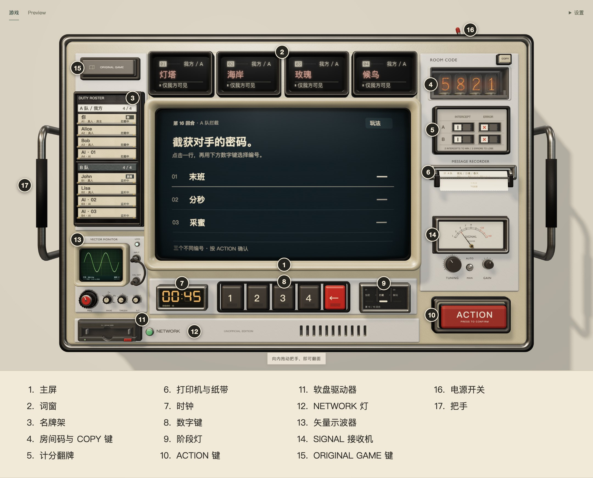

# Console 设计总览

Encrypto 的界面只有一样东西：一台摆在桌上的密码通信机。建房、组队、写线索、猜密码、看比分、查记录，都在这台机器上完成。本文说明它为什么是这个样子，以及每个部件在游戏里负责什么。

## 出发点

原版桌游的道具是纸卡、红色滤片、记分标记和一张记录纸。把它们照搬到屏幕上，得到的是一张虚拟的桌子；这个项目选了另一条路：**把整套桌游数字化成一台电子设备**。

所以每一件道具都换成了那个年代的机器会用的器件，它的外观和行为从这个器件的工作方式推出来：

| 桌游里的道具 | 机器上的部件 | 为什么是它 |
| --- | --- | --- |
| 红色滤片后面的四个密词 | 四个 LED 点阵词窗 | 滤光片后面的点阵模块是当时的字符显示器件 |
| 密码卡 | 密钥软盘 | 密码只属于一个人、一个回合；盘一弹出，密码就从屏幕上消失 |
| 线索纸条 | 主屏上的三行输入 | 终端一次只处理一件事 |
| 截获与失误的标记 | 八片机械翻牌 | 双稳态翻牌断电也保持读数 |
| 记录纸 | 打印机和纸带 | 公开的记录印在纸上，可以拉出来读，读完撕掉 |
| 沙漏 | 七段数码时钟 | — |
| 分队 | 名牌架上的插卡 | 谁在哪一队、谁在行动，一眼可见 |

原作只作为布局和配色的参照：一台机器似的屏幕，四个编号的红色窗口，黑、象牙白和红。机构不照搬。

## 原则

**一台机器承载全部信息。** 主屏一次只呈现当前要做的那一件事；房间、队伍、比分、时间和历史由周围的硬件各自承担。玩家不需要在页面之间切换。

**功能落在实体控件上。** 属于这台机器的功能都有一个建模出来的按键、旋钮或开关，不做看不见的热区。确认只有一个动作：红色的 ACTION 键。

**动作来自模拟，不来自时间线。** 显像管的开关机是一个小的电路模拟，纸带是被一只手撕断的薄片，示波器上的图形是一束电子在荧光粉上留下的光。代码里没有为这些效果手写的缓动曲线，只有常数。这样做出来的动作在被打断、被改向、帧率变化时仍然成立。

**仪器要好玩。** 示波器和 SIGNAL 表从真实的原理出发，每个旋钮都无级地、立刻可见地改变画面；在物理会让操作变得别扭的地方从宽处理。它们是等待时的玩具，不读取对局，也不影响对局。

**固定的印刷是英文，活动的显示是双语。** 机身上的刻字（NETWORK、ACTION、ROOM CODE……）属于模型，不随语言和对局变化。屏幕、名牌、阶段灯和纸带随语言切换。玩家的代号和写下的线索保持原文。

**中性色偏暖。** 黑、石墨、镍、合金和外壳都带着象牙白面板的暖色底。这是一个轻松的聚会游戏，机器可以有好玩的细节，但整体气氛不往冷峻的军用仪器上走。配色见[主题色](themes.md)。

**关于会话的设置放在机器外面。** 语言、主题和画质是页面右上角的普通界面，不做成机器上的开关。判断标准是这个设置说的是这台机器，还是这一次访问。

**私密的东西只出现在该出现的地方。** 密词只在自己队伍的词窗里，密码只在加密者读完软盘之后的主屏上；断线、换座位或软盘离开读头时立即收回。公开记录只采用服务器已经公布的内容。

**没有 3D 也能玩。** 每个控件都是真实的 DOM 元素，可以用键盘聚焦和操作，读屏软件读得到；线索用系统输入法输入。系统要求减少动态效果时，所有动作直接到达终点。窄屏换成紧凑终端，WebGL 不可用时退回文字界面。

## 部件

| 部件 | 在游戏里负责什么 | 详细说明 |
| --- | --- | --- |
| 主屏 CRT | 当前的任务：建房、组队、写线索、填密码、回执、终局；每一步之前的简报；四页玩法图解 | [显示器件](displays.md#主屏-crt) |
| 词窗 ×4 | 本队的四个密词，可以遮住 | [显示器件](displays.md#词窗-led-点阵) |
| 名牌架 | 两队各四个席位，谁是房主、谁是 AI、谁在行动 | [机械与交互](mechanics.md#名牌卡) |
| 辉光管与 COPY 键 | 房间码 | [显示器件](displays.md#辉光管房间码) |
| 计分翻牌 | 两队的截获与失误 | [机械与交互](mechanics.md#计分翻牌) |
| 打印机与纸带 | 所有已公开的回合 | [机械与交互](mechanics.md#纸带与密报记录) |
| 时钟与阶段灯 | 剩余时间；加密、拦截、解码走到哪一步 | [显示器件](displays.md#相位时钟) |
| 数字键与 ACTION | 填三位密码；唯一的确认键 | [机械与交互](mechanics.md#操作总则) |
| 软盘驱动器 | 加密者本回合的密码 | [机械与交互](mechanics.md#密钥软盘) |
| 矢量示波器 | 玩具：四个旋钮，李萨如图形 | [显示器件](displays.md#矢量示波器) |
| SIGNAL 接收机 | 玩具：调谐与增益 | [显示器件](displays.md#signal-表) |
| NETWORK 灯 | 与服务器的连接 | [显示器件](displays.md#指示灯) |
| ORIGINAL GAME 键 | 原版桌游的介绍与链接 | [机械与交互](mechanics.md#词窗手册键与房间码) |
| 电源开关与把手 | 开关机；向内拖把手翻到背面 | [机械与交互](mechanics.md#把手与翻面) |
| 背面：DC、电池、网线、AUX、声音开关 | 供电、连接和声音；拔掉它们，正面随之反应 | [背面联动](rear-linkage.md) |

## 文档

| 文档 | 内容 |
| --- | --- |
| [代码组织](code.md) | 代码放在哪里、数据怎么流动、怎样加一个控件或一页屏幕 |
| [显示器件](displays.md) | 主屏、显像管的模拟、玻璃光学、LED 点阵、示波器、辉光管、时钟、仪表和指示灯 |
| [机械与交互](mechanics.md) | 每个会动、可操作的部件：操作方式、时序和手机布局 |
| [背面联动](rear-linkage.md) | 供电、网线、AUX 与正面的关系 |
| [声音](audio.md) | 什么动作出什么声音，背景音乐 |
| [主题色](themes.md) | 四套配色和它们的色值 |
| [画质与性能](quality.md) | 画质档位、自动档、闲置时的节流和实测开销 |
| [开发预览](preview.md) | 不连服务器打开任意状态和特写的 URL 参数 |
| [教程插图](guide-art.md) | 玩法图解里的三个人物 |
| [建模流水线](../../assets/console/README.md) | 怎样修改 3D 模型并导出 |
| [音频制作](../../assets/audio/README.md) | 怎样重新制作音效和音乐 |
