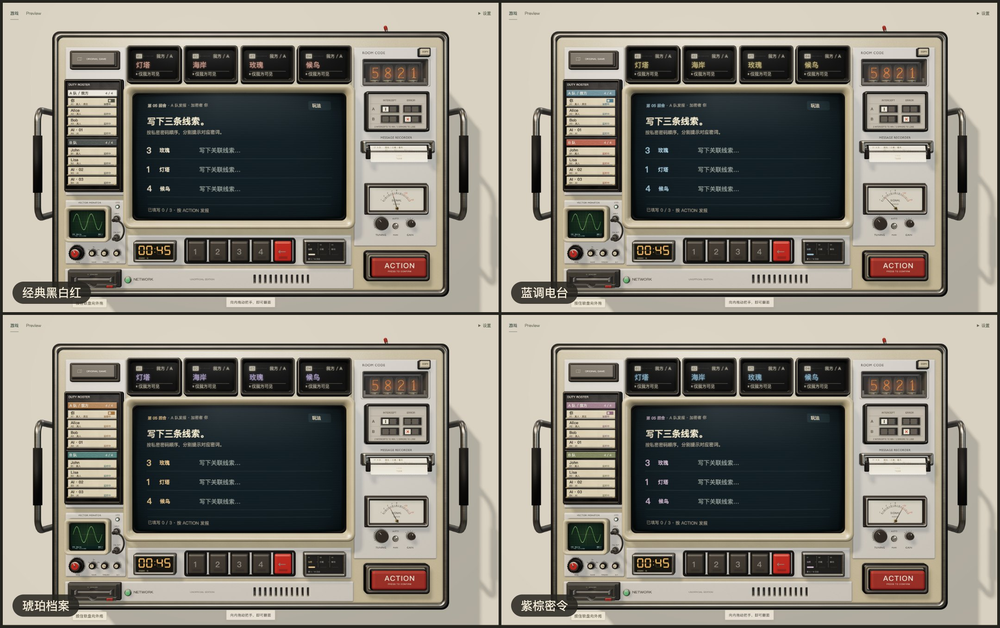

# 主题色

「设置」里有四套主题，选择保存在浏览器本地。四套主题共用同一台机器：暖象牙白外壳、纸张、金属件、朱红的实体按钮和绿色的示波器都不随主题变化。主题只改变三样东西：双方队伍的身份色、词窗的设备色，以及把它们用到屏幕、队牌和指示灯上的方式。

配色定义在 `web/src/console/model.ts` 的 `themeChoices`。色值是参考经典 Decrypto 视觉重新设计的 sRGB 色板，不是官方发布的品牌色。

相关文档：[显示器件](displays.md) · [设计总览](README.md)

## 队伍身份

| 主题 | ID | 己方印刷 / 屏幕 | 对方印刷 / 屏幕 |
|---|---|---|---|
| 经典黑白红（默认） | `classic` | `#383B36` / `#E9DFC7` | `#2C3539` / `#AFC2CC` |
| 蓝调电台 | `radio` | `#365D70` / `#A4C7D8` | `#8A4436` / `#E4AE99` |
| 琥珀档案 | `amber` | `#7A542B` / `#E5C28B` | `#315F62` / `#A0CAC7` |
| 紫棕密令 | `violet` | `#674E64` / `#CDB6CD` | `#586244` / `#BCC99C` |

每个身份有四个值，因为搪瓷、纸上的油墨和发光的字是不同的材质：

- `ink` 用于浅色纸张（名牌卡、纸带）和手机布局。
- `light` 用于暗屏（主屏文字、相位指示灯）。
- `plate` / `onPlate` 用于实体队牌的搪瓷底色和上面的字。经典主题的己方是 `#EFE5CF` 白牌配 `#383B36` 深字，并加一圈同色描边；其余牌面都以各自的印刷色作底，配 `#F2E8D3` 暖白字。

「己方 / 对方」按玩家自己的队伍映射（`teamPalette`）：同一套主题下，A 队玩家看到的己方色就是 B 队玩家看到的对方色。A / B 字样和「我方」标注始终保留，颜色不是区分队伍的唯一依据。还没有入队时，队伍标签使用中性的灰绿色。

偏好保存在 `localStorage` 的 `decrypto-theme`。早先的 `rose` 会被读作 `radio`；未知的值或无法读取存储时回退到 `classic`。

## 词窗：LED 点阵

词窗使用独立于双方身份色的第三种「设备色」。同一主题下两队看到的词窗配色相同；队牌和主屏的行动提示仍按己方 / 对方区分。设备色不复用任何一方的光色，避免暗示词窗属于某一队。

| 主题 | 关键词发光色 | 编号与说明发光色 |
|---|---|---|
| 经典黑白红 | `#F1B09D` 珊瑚红 | `#D7CFB8` 暖白 |
| 蓝调电台 | `#E3CF86` 香槟黄 | `#D7CFB8` 暖白 |
| 琥珀档案 | `#CBBAED` 薰衣草紫 | `#D7CFB8` 暖白 |
| 紫棕密令 | `#9BCEEC` 冰蓝 | `#D7CFB8` 暖白 |

后三种设备色按 OKLCH 选取，再转换成 sRGB 供 Canvas 和 Three.js 使用：蓝调 `oklch(85.5% .095 95)`，琥珀 `oklch(82% .072 300)`，紫棕 `oklch(82.5% .068 235)`。选色的依据是与两个身份色互补：暖黄配蓝与砖红，淡紫配琥珀与青绿，冰蓝配灰紫与橄榄；经典主题用珊瑚红配黑白。

- 底板保持近黑，不铺整块的主题背景。
- 脱机信息使用暖白的灯并写明文字，不增加第三种发光色。
- 画给模块的纹理里，RGB 是语义通道（关键词、说明、脱机提示），最终颜色在着色器里由这张表给出。
- 四个模块共用一条换色总线：全部熄灭之后交换配色，再依次启动。遮住词或撤销密钥时内容立即替换，不等换色完成。

## 词窗：红宝石管（开发对比）

开发对比台（`?words=crt`）可以把词窗换成早先的红宝石显像管。它的字色与 LED 的关键词色相同，两种硬件共用一个设备色。

| 主题 | 暗底 | 字色 | 内沿 / 网格基色 |
|---|---|---|---|
| 经典黑白红 | `#4A1612` | `#F1B09D` | `#8E493A` |
| 蓝调电台 | `#292411` | `#E3CF86` | `#6C6342` |
| 琥珀档案 | `#262031` | `#CBBAED` | `#675D7C` |
| 紫棕密令 | `#142731` | `#9BCEEC` | `#47687C` |

字色、塌缩时的亮线、余辉和暗部染色随同一个画面快照一起交换。否则换到蓝色主题后关机，余辉会闪回红色。

## 不随主题变化的颜色

| 用途 | 印刷 | 暗屏 |
|---|---|---|
| 通用设备字色 | `#595A4E` | `#D7CFB8` |
| 警告 | `#8A4C23` | `#EDBC80` |

- 主屏底色 `#111E24`、正文暖白 `#ECE0C4`。
- 回执与终局的结果色：对本队是好消息 `#8BC995`，坏消息 `#ED9781`，旁观或平局 `#B9C5C7`。完整回执以真正增加的截获或失误判断利弊，解码成功不会把本轮被截获的回执重新染成绿色。各项判定同时写明队伍和标记变化。
- 计分翻牌的墨色计数与朱红叉号、计分板上的 A / B 字母、相位时钟的琥珀色、示波器的绿色、辉光管的橙色。

计分瞬间的主屏荧光与背景脉冲使用同一组结果色（`scoreFeedback.ts`）：我方截获或对方失误为绿，对方截获或我方失误为珊瑚红，旁观为中性灰蓝。背景墙最多混入 15% 结果色，1.2 秒后回到原色；机身、词窗和队牌保持自己的材质颜色。减少动态效果时不播放脉冲，静态结果文字和比分仍然可见。

## 换主题时发生什么

换主题是一次关机再开机：主屏管先让旧画面熄灭，在黑暗中换上新配色再点亮；词窗模块全部熄灭后换色；两块队牌抬起、换色、重新落位。快速连选只显示最后一次选择。颜色作用在运行时材质和画布纹理上，不加载另一份模型。过程见[显示器件](displays.md)。

## 可读性

`web/scripts/console.test.mjs` 对每套主题检查实色对比度，最低 4.5:1：

| 文字 | 背景 |
|---|---|
| 双方的 `ink` | 象牙白 `#E6DEC9` |
| 双方的 `onPlate` | 各自的 `plate` |
| 双方的 `light` | 主屏底色 `#111E24` |
| 红宝石管字色 | 该主题的暗底 |
| 两种 LED 光色 | 未点亮的模块 `#080A09` |

同一组测试还要求：两种 LED 光色不同；LED 关键词色等于红宝石管字色；设备色不等于任何一方的 `light`。

这是平面色之间的检查。机身是受光照的三维材质，玻璃有反射，点阵有颗粒，整机的可读性仍需要在浏览器里看。
