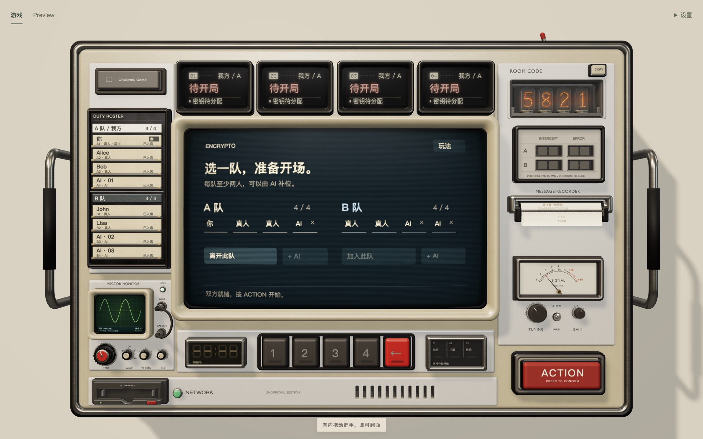
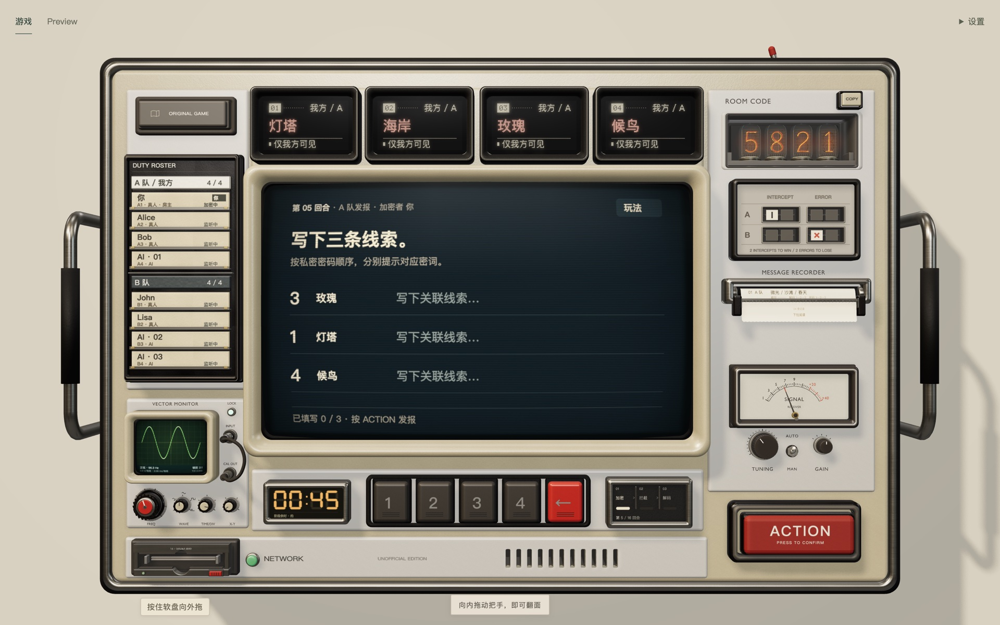
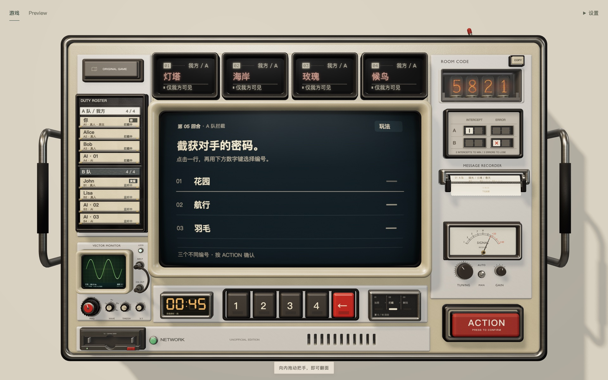
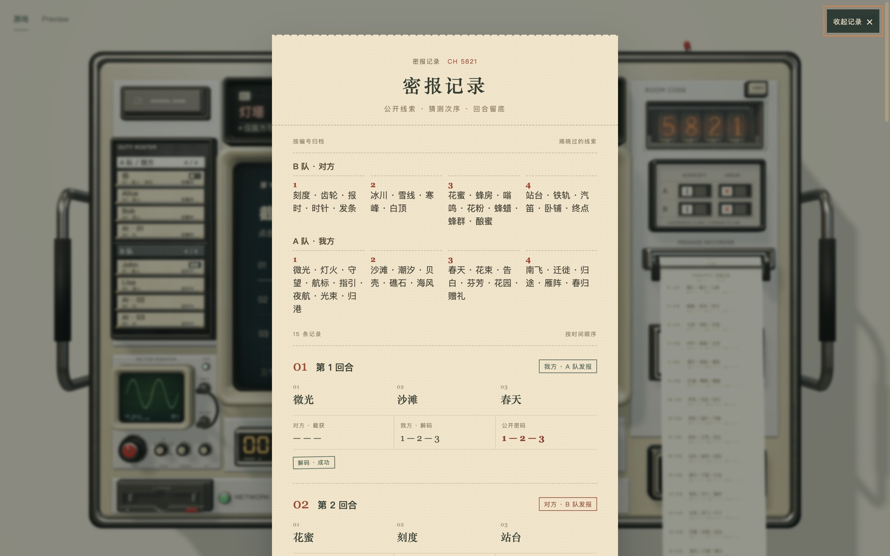
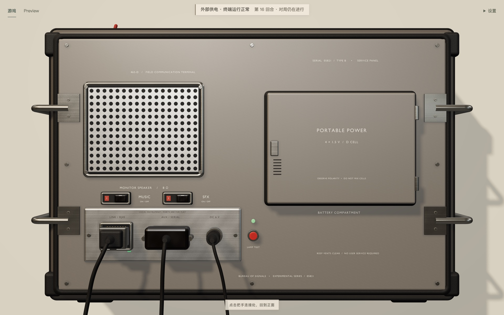
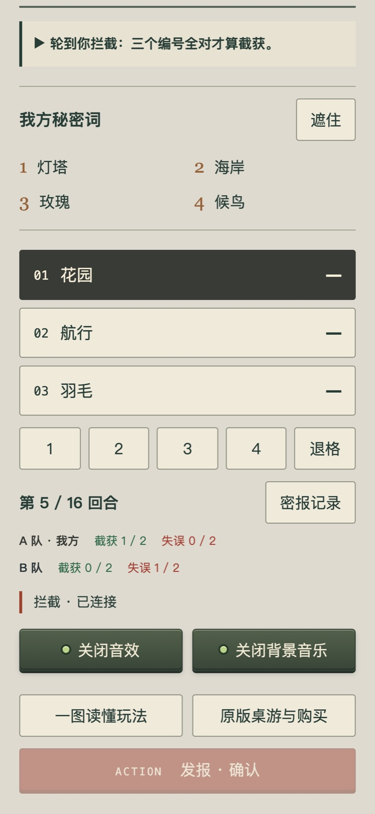

# 玩法

Encrypto 是两支队伍之间的猜词游戏。每队有四个只有自己看得见的密词，轮流用线索把一组三位密码传给队友，同时提防对手从历次线索里摸出规律。先截获对手两次的一队获胜，先译错自己人两次的一队落败。

规则取材于桌游《Decrypto》，想了解原作可以看[原版规则](https://www.scorpionmasque.com/sites/scorpionmasque.com/files/decrypto_en_rules_20sep2019.pdf)。机器主屏右上角的「玩法」也有一份四页的图解。

想先看一遍实际的过程，这里有一段 [52 秒的视频](media/gameplay.mp4)。

## 开一局

1. 打开页面，在主屏上填好代号，按红色的 **ACTION** 建立频道。
2. 右上角的辉光管亮出四位房间码，按旁边的 **COPY** 复制，发给朋友。朋友选「加入频道」，填代号和房间码。
3. 进入房间的人自动坐到人少的一队，也可以在主屏上换队。每队 2 到 4 人。
4. 人不够时，房主可以给任意一队加 AI 队员。
5. 两队各有至少 2 人后，房主按 **ACTION** 开始。

没有座位的人可以留在房间里旁观。

## 一个回合

两队轮流发报，A 队先开始。每个回合分三步，主屏在每一步开始前用一页简报说明轮到谁、你现在要做什么。

### 1. 加密

发报一队里轮到的那位是**加密者**。密钥软盘送进驱动器，读完之后，主屏上出现本回合的三位密码，例如 `3 · 1 · 4`，以及它们对应的密词。

加密者按密码的顺序写三条线索：第一条指向 3 号词，第二条指向 1 号词，第三条指向 4 号词。写完按 **ACTION** 发出，三条线索对所有人公开。

身边有人时，弹出软盘可以立刻遮住密码，点一下词窗可以遮住密词。

### 2. 拦截

对手先猜。他们看不到发报一队的密词，只能对照此前公开过的线索，猜这三条线索各指向几号词。点主屏上的一行，再按机身上的数字键 1–4，三位都填好后按 **ACTION**。

前两个回合没有这一步，因为还没有可以参照的记录。

### 3. 解码

然后轮到加密者的队友。他们看得到自己的四个密词，用同样的方式填三位数字并提交。

同队的人共用一次提交：任何一位按下 **ACTION**，这一步就结束。其他座位能在自己的屏幕上看到对方正填到第几位。

### 结算

主屏给出本回合的回执：密码是什么，双方各猜了什么，对不对。

| 结果 | 记分 |
| --- | --- |
| 对手的三位与密码完全一致 | 对手记一次**截获** |
| 队友的三位与密码不一致 | 发报一队记一次**失误** |

两件事分别计算，同一回合可以同时发生。右侧的计分板上，对应的翻牌会翻过来。几秒之后下一个回合开始，换另一队发报。

## 胜负

- 一队截获对手 **2 次**，获胜。
- 一队失误 **2 次**，落败。
- 同一回合里两队同时达成条件，或者打满 **16 个回合**仍未分出胜负，则比较「截获次数减失误次数」，高的一队获胜，相同为平局。

终局时双方的四个密词一起公开。任何一位玩家按 **ACTION** 都可以让房间回到大厅，原班人马再来一局。

## 时间

| 步骤 | 时限 |
| --- | --- |
| 写线索 | 90 秒 |
| 拦截、解码 | 60 秒 |

时钟在数字键的左边，最后 15 秒变色，主屏同时给出提醒。时间到了还没有提交，服务器替你交：

- 线索发出已经写下的部分，空着的行记为 `—`；
- 猜测发出已经选好的三位；没选完则记为放弃，这次拦截或解码算失败。

## 查看记录

打印机出纸口垂着一小段纸。点它或向下拉，机器把所有已经公开的回合打印出来：每条线索、公开的密码、双方的猜测和成败，并按 1–4 号把每队用过的线索归在一起。推理对手的密词主要靠这张纸。

按 Esc 或点纸外的空白处收起，机器上的那张纸随之撕掉。

## 和 AI 一起玩

AI 队员和真人一样写线索、猜数字，其他人能在屏幕上看到它正在处理第几条。一个步骤里只要有真人可以行动，就等真人提交；全是 AI 时由 AI 完成。

AI 需要服务器配置模型的密钥，见[构建与运行](getting-started.md#ai-队员)。没有配置或者模型没能答上来时，AI 会交出「线索暂缺」这样的备用答案，主屏上会注明。

## 这台机器

| 部件 | 用来做什么 |
| --- | --- |
| 主屏 | 当前要做的事；「玩法」打开图解 |
| 四个词窗 | 本队的四个密词，点一下遮住 |
| 名牌架 | 两队的成员，谁在行动 |
| 辉光管与 COPY | 房间码 |
| 计分板 | 两队的截获与失误 |
| 打印机 | 公开记录 |
| 时钟与阶段灯 | 剩余时间，当前在哪一步 |
| 数字键与 ACTION | 填数字，确认 |
| 软盘驱动器 | 加密者的密码 |
| 示波器与 SIGNAL 表 | 等待的时候可以拧着玩，不影响对局 |
| ORIGINAL GAME 键 | 原版桌游的介绍和购买链接 |

**键盘。** 每个控件都可以用 Tab 聚焦。数字键 1–4 和 Backspace 对应机身上的键盘，Ctrl/Cmd+Enter 等于 ACTION，Esc 关闭打开的页面。

**设置。** 页面右上角的「设置」里可以换语言（中文 / English）、主题配色和画质。它们只影响你自己的页面。

**背面。** 按住任意一侧把手向机身里面拖，机器会翻过来。背面有电源、网线、AUX 接口、电池仓，以及音乐和音效的开关；拔掉它们，正面会有相应的反应。点背面的把手连接座翻回正面。什么都不动也能正常玩。

**手机。** 窄屏上页面换成一个紧凑的终端，功能相同，没有 3D 机身。

## 掉线了怎么办

刷新页面、网络中断或者服务器重启之后，页面会自己连回去，回到原来的座位和原来的回合，写了一半的线索也还在。对局进行中座位一直为你保留。

房间里所有真人都离开满 10 分钟，房间才会关闭。
